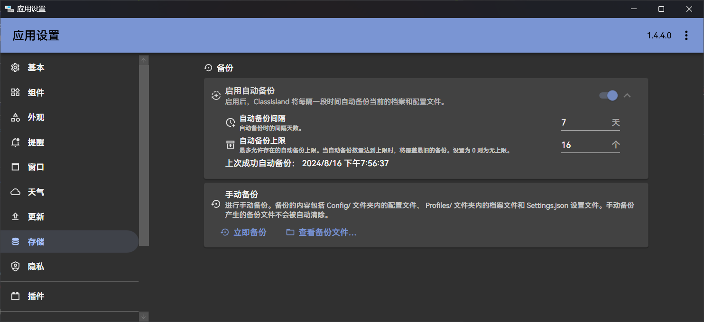

# 应用数据备份

本文章主要描述 ClassIsland 内置的备份功能，以及如何手动备份和恢复应用数据。

ClassIsland 内置了应用数据备份功能，可以在[【应用设置】->【存储】](classisland://app/settings/storage)中查看和调整相关设置。

进行备份时，会将以下文件和文件夹复制到`./Backups/Backup_<时间>`文件夹下：

- `Settings.json` - 应用设置
- `Config/` - 应用其它配置
- `Profiles/` - [档案](./profile-settings-page.md)信息（包括课表、时间表、科目等）

!!! note
    为了您的数据安全，在使用应用内置的备份功能的同时，也建议您手动将相关配置文件备份到其它地方。

## 自动备份

ClassIsland 默认会每隔 7 天进行一次自动备份，并将备份文件保存到`./Backups/Auto_Backup_<时间>`文件夹下。默认仅保留最近 16 次自动备份，手动备份和更新备份产生的备份文件不受影响。

## 更新备份

ClassIsland 在版本更新时，会自动把应用数据被分到`./Backups/Update_Backup_<应用版本>_<时间>`文件夹下。

## 恢复备份

如果出现配置文件损坏/丢失等情况，您可以在**应用退出的情况下**，将备份的数据文件覆盖到应用目录下恢复数据。
