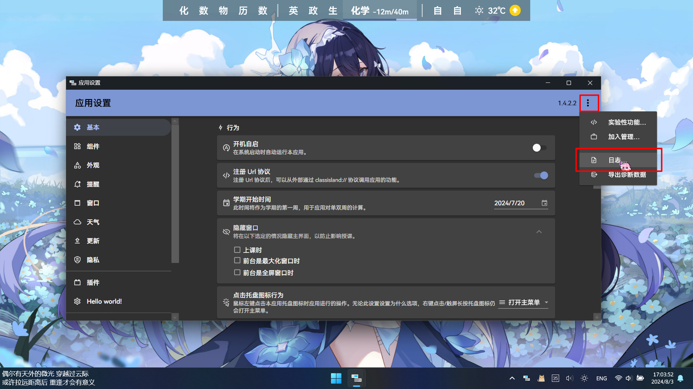
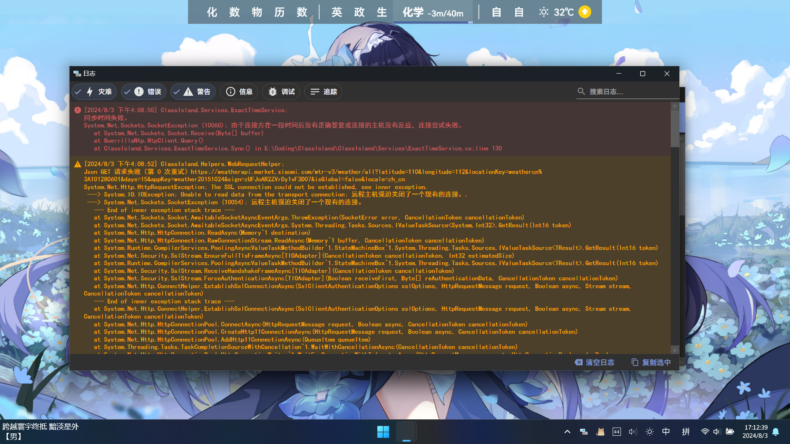
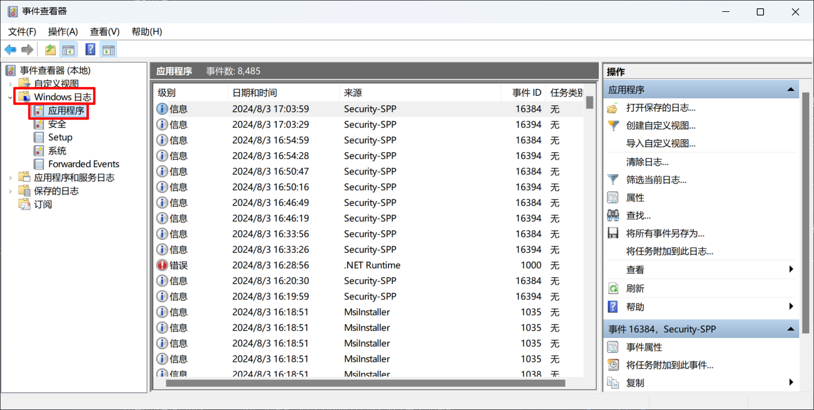
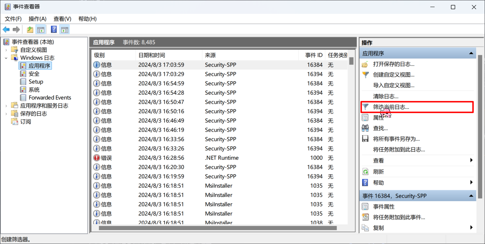
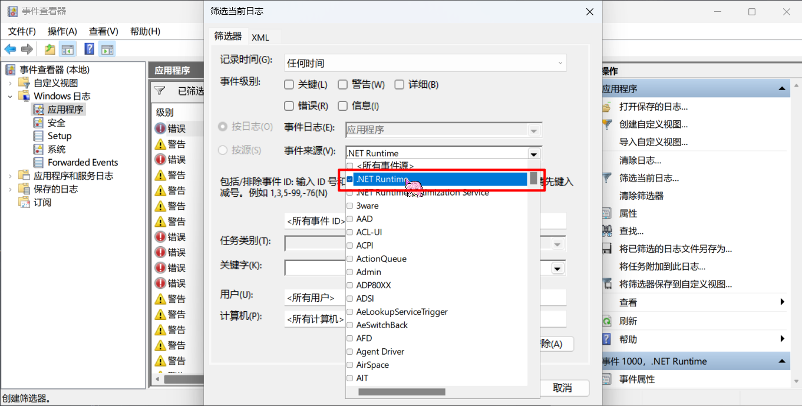
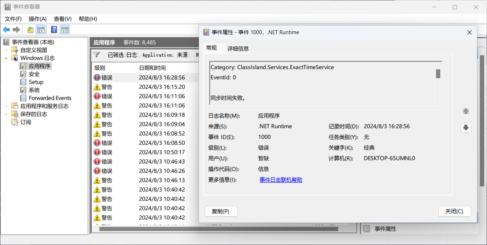
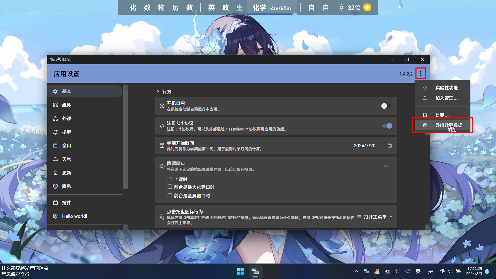
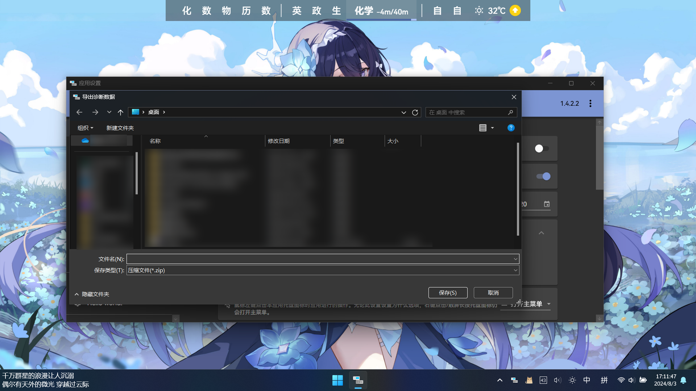

# 如何获取调试信息

当您在使用 ClassIsland 的过程中遇到问题时，您可以[向开发者反馈](https://github.com/ClassIsland/ClassIsland/issues)，或者在[Discussions](https://github.com/ClassIsland/ClassIsland/discussions)和[QQ 群](https://qm.qq.com/q/7BWNv3FcjK)向其它用户和开发者求助。在这时，您可能会被要求提供日志、崩溃报告或运行环境等信息。本文档主要讲述如何获取这些信息，以便诊断问题。

!!! warning "在此之前……"

    您应当先在[应用帮助](index.md)和[常见问题（FAQ）](faq.md)等文档查找您遇到的问题。在向别人寻求帮助或向开发者反馈前，不妨先看看这些文档，尝试自己解决问题。

## 收集日志

### 收集当前运行的日志

您可以通过以下方法打开日志窗口：

1. 打开[【应用设置】](classisland://app/settings)。
    
2. 点击【更多选项…（右上角三个点）】->【日志…】即可打开日志窗口。
    

日志窗口会显示当前运行的最近 1000 条日志。默认情况下仅显示【警告】及以上级别的日志。您可以通过勾选日志等级筛选条件中的其它日志等级来查看其它等级的日志。您也可以在【搜索日志…】中输入要筛选的文本或类别来快速查看某一级别的日志。



点击日志条目可以选中对应的日志，按住<kbd>Ctrl</kbd>或<kbd>Shift</kbd>可以多选日志。选中日志后，点击【复制选中】可以将选择的日志复制到剪贴板。

### 收集以前的日志

!!! note
    使用此方法只能收集【警告】以及以上等级的日志。

您可以使用以下方法收集之前运行的日志：

1. 在运行输入以下命令打开【事件查看器】：

    ```shell
    eventvwr.msc
    ```

2. 在左侧的导航栏中依次进入【Windows 日志】->【应用程序】
    
3. 点击右侧操作栏【筛选当前日志…】
    
4. 在【事件来源】条件中选择“.NET Runtime”，然后点击【确定】关闭筛选窗口。
    
5. 此时视图中仅显示来自 .NET 运行时的日志信息。您可以在这些日志中查找 ClassIsland 相关的日志。
    

## 导出诊断数据

!!! warning
    诊断信息可能包含敏感数据，在分享时请注意检查。

诊断数据包含了应用设置、当前加载的档案、集控配置（如有）、系统环境和当前运行的日志（最多 1000 条）等信息。您可以按照以下的步骤导出诊断信息。

1. 打开[【应用设置】](classisland://app/settings)。
    
2. 点击【更多选项…（右上角三个点）】->【导出诊断数据…】
    
3. 选择保存诊断数据的位置。
    
4. 稍等片刻，导出完成后应用会自动打开保存诊断数据的位置。
