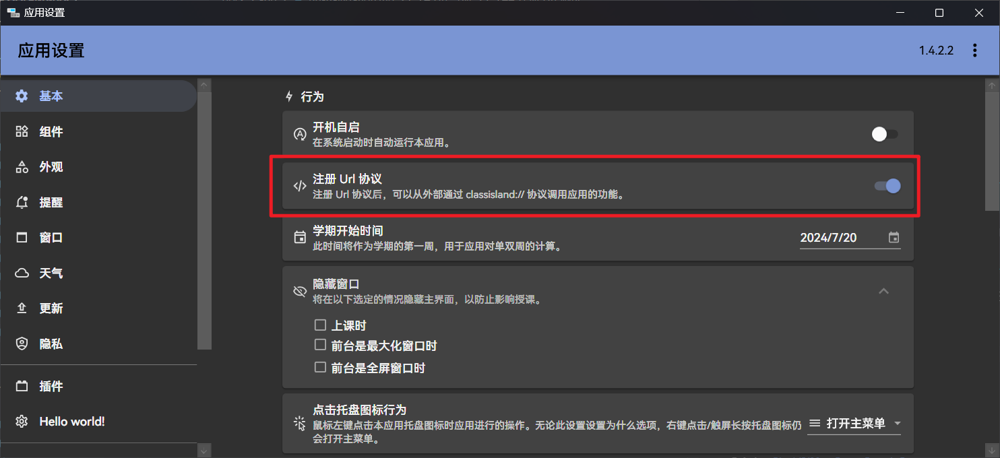

# Uri 导航

!!! info
    本文章主要讲述用户如何使用 Uri 导航。如果您想了解在 ClassIsland 注册自定义 Uri 的方法，请参阅[开发 Uri 导航](../dev/uri-navigation.md)。

ClassIsland 支持在应用内通过 Uri 进行导航，同时也在系统注册 Url 协议，从外部调用 ClassIsland 的各项功能。

ClassIsland 默认的 Uri 导航协议是 `classisland://`。应用内置的导航路径在 `classisland://app/` 下，插件扩展的导航路径一般在 `classisland://plugins/` 下。

## 注册 Url 协议

您可以在[【应用设置】->【基本】](classisland://app/settings/general) 中启用【注册 Url 协议】选项以注册 Url 导航协议。



!!! warning
    在有些情况下，部分杀毒软件可能会将【注册 Url 协议】视为敏感行为进行拦截。如果在开启此功能时出现这种情况，请点击【允许】。

注册完成后，您可以通过在【运行】中调用[`classisland://app/test`](classisland://app/test)来测试注册是否成功。

## 支持的功能

您可以通过 Url 协议调用以下功能：

### 应用设置

``` plaintext
classisland://app/settings/{page}/[...]
```

打开应用设置。

**参数**

| 参数 | 类型 | 说明 |
| -- | -- | -- |
| page | `string` | 要导航到的设置页面 id |

您可以通过修改 `page` 参数导航到指定的设置页面。以下为 ClassIsland 内置的设置页面以及其对应的 `category` 参数值。

| 页面 | 值 | 类型 |
| -- | -- | -- |
| 基本 | general | 内置 |
| 组件 | components | 内置 |
| 外观 | appearance | 内置 |
| 提醒 | notification | 内置 |
| 窗口 | window | 内置 |
| 天气 | weather | 内置 |
| 更新 | update | 内置 |
| 隐私 | privacy | 内置 |
| 插件 | classisland.plugins | 扩展 |
| 关于 ClassIsland | about | 关于 |
| 测试页面 | test-settings-page | 调试 |
| 调试 | debug | 调试 |
| 笔刷 | debug_brushes | 调试 |

### 档案设置

``` plaintext
classisland://app/profile/
```

打开档案设置窗口。

### 换课

``` plaintext
classisland://app/class-swap
```

打开换课窗口。

!!! note
    在当前没有加载课表时，此 Uri 不起作用。

### 测试导航

``` plaintext
classisland://app/test
```

打开测试导航窗口。
