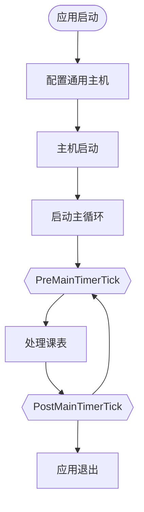

# 事件

事件是相应 ClassIsland 生命周期变化和课表状态改变的重要方式。

.NET 通用主机和 ClassIsland 提供了一系列的事件，您可以通过调取对应的服务等方式订阅这些事件。

## 生命周期

以下是 ClassIsland 的生命周期及事件触发的示意图：

## 主计时器事件

这些事件会每隔 50ms 触发一次，适用于进行轮询操作。

### 课表处理前事件

在主计时器开始处理课表信息前触发。

**服务：** `ClassIsland.Core.Abstractions.Services.ILessonService`

**事件名：** `PreMainTimerTicked`

**参数：** *无*

### 课表处理后事件

在主计时器完成处理课表信息后触发。

**服务：** `ClassIsland.Core.Abstractions.Services.ILessonService`

**事件名：** `PostMainTimerTick`

**参数：** *无*

## 课表事件

以下事件会在课表的对应状态触发。

### 上课事件

当进入上课类型的时间点时触发。

**服务：** `ClassIsland.Core.Abstractions.Services.ILessonService`

**事件名：** `OnClass`

**参数：** *无*

### 下课事件

当进入课间休息类型的时间点时触发。

**服务：** `ClassIsland.Core.Abstractions.Services.ILessonService`

**事件名：** `OnBreakingTime`

**参数：** *无*

### 放学事件

当放学（当前时间超出今天的时间表的最后一个时间点）时触发。

**服务：** `ClassIsland.Core.Abstractions.Services.ILessonService`

**事件名：** `OnAfterSchool`

**参数：** *无*

### 时间状态改变事件

当当前时间状态改变时触发。

**服务：** `ClassIsland.Core.Abstractions.Services.ILessonService`

**事件名：** `CurrentTimeStateChanged`

**参数：** *无*
