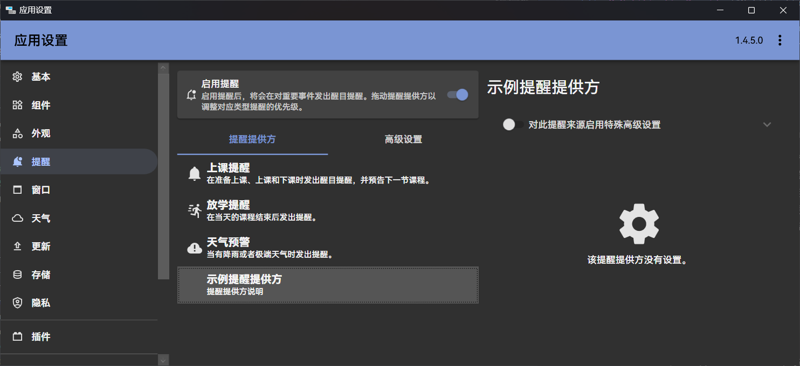
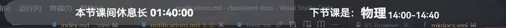
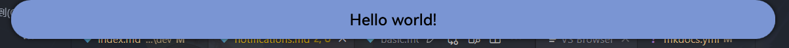

# 提醒

本文主要讲述如何注册提醒提供方、添加提醒设置界面和发送提醒。

!!! info
    这篇文章主要讲述如何开发提醒。如果您只是要调整提醒设置的普通用户，请参考[这篇文章](../app/notifications.md)。

<!-- ??? note "演示视频"
    <video src="../image/notifications/1724501396690.mp4" muted controls loop></video> -->

提醒是 ClassIsland 中用于展示重要信息的功能，可以通过全屏特效、语音、音效等方式增强提醒效果。提醒由提醒提供方发出，由提醒主机管理提醒和提醒提供方，最终由主界面展示。

!!! example
    注册提醒提供方的完整示例代码可以在[示例插件仓库](https://github.com/ClassIsland/ExamplePlugins/tree/master/PluginWithNotificationProviders)上查看。

## 注册提醒提供方

提醒提供方是一个实现`INotificationProvider`接口的托管服务（`IHostService`），会在应用主机启动后自动启动。

要注册提醒提供方，我们首先需要创建一个实现了`INotificationProvider`和`IHostedService`的提醒提供方类。如下方代码所示，

``` csharp title="MyNotificationHost.cs"
using ClassIsland.Core.Abstractions.Services;
using ClassIsland.Shared.Interfaces;
using Microsoft.Extensions.Hosting;

namespace PluginWithNotificationProviders.Services.NotificationProviders;

public class MyNotificationProvider : INotificationProvider, IHostedService
{
    public string Name { get; set; } = "示例提醒提供方";
    public string Description { get; set; } = "提醒提供方说明";
    public Guid ProviderGuid { get; set; } = new Guid("DD3BC389-BEA9-40B7-912B-C7C37390A101");
    public object? SettingsElement { get; set; }
    public object? IconElement { get; set; }

    public async Task StartAsync(CancellationToken cancellationToken)
    {
    }

    public async Task StopAsync(CancellationToken cancellationToken)
    {
    }
}
```

上面的代码内容可能有点多，不用害怕，我们一点一点来看。

代码中的`ProviderGuid`属性是用于区分提醒提供方的唯一 ID，您可以使用 Visual Studio 自带的 GUID 生成器或者 Resharper/Rider 的 `nguid` 缩写快速创建一个 GUID。

`Name`和`Description`属性分别是提醒提供方名称和描述，这些信息会在提醒设置中显示。

接下来我们需要把这个提醒提供方注册到提醒主机上。添加以下高亮代码：

``` csharp title="MyNotificationHost.cs" hl_lines="9-15"
// ...

namespace PluginWithNotificationProviders.Services.NotificationProviders;

public class MyNotificationProvider : INotificationProvider, IHostedService
{
    // ...

    private INotificationHostService NotificationHostService { get; }

    public MyNotificationProvider(INotificationHostService notificationHostService)
    {
        NotificationHostService = notificationHostService;
        NotificationHostService.RegisterNotificationProvider(this);
    }

    // ...
}

// ...
```

在上面的代码中，高亮的部分属于这个提醒提供方的构造函数。我们在构造函数的参数中获取了提醒主机服务，然后把提醒主机服务保存到一个名为`NotificationHostService`的只读属性中备用。接着我们调用了提醒主机服务的`RegisterNotificationProvider`方法，将这个提醒提供方注册到了提醒主机上。

接着我们还需要在[插件初始化方法](./plugins/plugin-base.md#初始化方法)，或应用主机配置方法中添加以下代码，将这个提醒提供方注册到应用主机上。

```csharp
services.AddHostedService<MyNotificationProvider>();
```

上面的代码将这个提醒提供方作为托管服务注册到了应用主机上，这样这个提醒提供方服务就会在应用启动时自动启动，同时也会在提醒设置中显示。



## 显示提醒

注册好提醒主机后，我们的提醒主机就可以发送提醒了。您可以通过订阅您感兴趣的事件（如[上课事件](./events.md#上课事件)、[下课事件](./events.md#下课事件)等），在合适的时机显示提醒。

### 组成

一个提醒由以下部分组成：

- **遮罩（Mask）**：提醒进入时显示的内容，使用主题色作为背景，一般用于吸引注意力和总结提醒内容。
    
- **正文（Overlay）_（可选）_**：遮罩显示结束后，显示的提醒正文。如果没有正文内容


### 订阅事件

我们以在下课时显示提醒为例，添加以下代码获取课程服务，并订阅[下课事件](./events.md#下课事件)：

``` csharp title="MyNotificationHost.cs" hl_lines="8 11 14 17 20-23"
// ...

namespace PluginWithNotificationProviders.Services.NotificationProviders;

public class MyNotificationProvider : INotificationProvider, IHostedService
{
    private INotificationHostService NotificationHostService { get; }
    public ILessonsService LessonsService { get; }

    public MyNotificationProvider(INotificationHostService notificationHostService,
     ILessonsService lessonsService)
    {
        NotificationHostService = notificationHostService;
        LessonsService = lessonsService;  // 将课程服务实例保存到属性中备用
        NotificationHostService.RegisterNotificationProvider(this);
        
        LessonsService.OnBreakingTime += LessonsServiceOnOnBreakingTime;  // 注册下课事件
    }

    private void LessonsServiceOnOnBreakingTime(object? sender, EventArgs e)
    {
    
    }

    // ...
}
```

上面高亮的代码通过在构造函数中添加课程服务参数，获取了课程服务实例，并保存到`LessonsService`属性中备用。接着订阅了[下课事件](./events.md#下课事件)`OnBreakingTime`的事件处理程序`LessonsServiceOnOnBreakingTime`。当下课时，事件处理程序`LessonsServiceOnOnBreakingTime`中的代码就会被调用。

### 提醒请求

显示提醒需要通过提醒主机的`ShowNotification`方法，并在参数传入提醒请求（`NotificationRequest`）。此外，使用此方法的异步重载`ShowNotificationAsync`可以等待提醒显示完毕。

!!! warning
    `ShowNotification`和`ShowNotificationAsync`方法**必须**从对应的提醒提供方调用，否则会引发异常。

以下是几个比较常用的提醒请求属性，其它属性也将在文章后续介绍。完整的提醒请求属性请见[源代码文档](https://github.com/ClassIsland/ClassIsland/blob/master/ClassIsland.Shared/Models/Notification/NotificationRequest.cs)。

| 属性名 | 类型 | 必填？ | 说明 |
| -- | -- | -- | -- |
| MaskContent | `object` | **是** | 提醒遮罩内容，在提醒进入时显示。 |
| MaskDuration | `TimeSpan` | 否 | 提醒遮罩显示时长，默认为 5 秒。|
| OverlayContent | `object` | 否 | 提醒正文内容。 |
| OverlayDuration | `TimeSpan` | 否 | 提醒正文显示时长，默认为 5 秒。|

下面是一个调用`ShowNotification`方法显示提醒的示例：

``` csharp
NotificationHostService.ShowNotification(new NotificationRequest()
{
    MaskContent = new TextBlock(new Run("Hello world!"))
    {
        VerticalAlignment = VerticalAlignment.Center,
        HorizontalAlignment = HorizontalAlignment.Center
    }
});
```

我们可以把这段代码添加到下课事件的事件处理程序中：

``` csharp title="MyNotificationHost.cs" hl_lines="9-16"
// ...
namespace PluginWithNotificationProviders.Services.NotificationProviders;

public class MyNotificationProvider : INotificationProvider, IHostedService
{
    // ...
    private void LessonsServiceOnOnBreakingTime(object? sender, EventArgs e)
    {
        NotificationHostService.ShowNotification(new NotificationRequest()
        {
            MaskContent = new TextBlock(new Run("Hello world!"))
            {
                VerticalAlignment = VerticalAlignment.Center,
                HorizontalAlignment = HorizontalAlignment.Center
            }
        });
    }
    // ...
}
```

上面的代码会在下课时显示一个遮罩为文本“Hello world!”的提醒，并且为文本设置了水平和竖直居中的属性。效果如下图：



在代码中手动初始化控件不是一件很容易的事情，特别对于比较复杂的提醒内容而言，所以我们一般会将提醒要显示的内容封装成一个控件。比如如我们将上面的“Hello world!”文本框封装为一个名为`MyNotificationControl`的控件，那么我们就可以把刚刚显示提醒部分的代码变成这样：

``` csharp
NotificationHostService.ShowNotification(new NotificationRequest()
{
    MaskContent = new MyNotificationControl()
});
```

