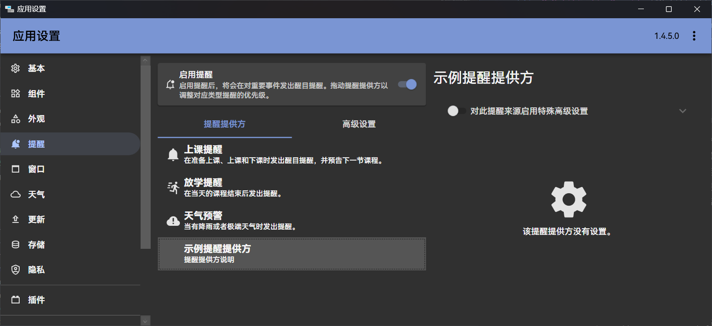
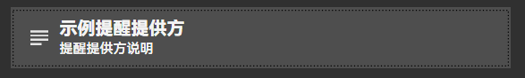
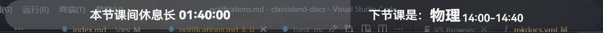
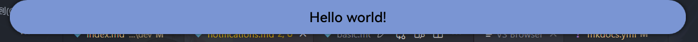
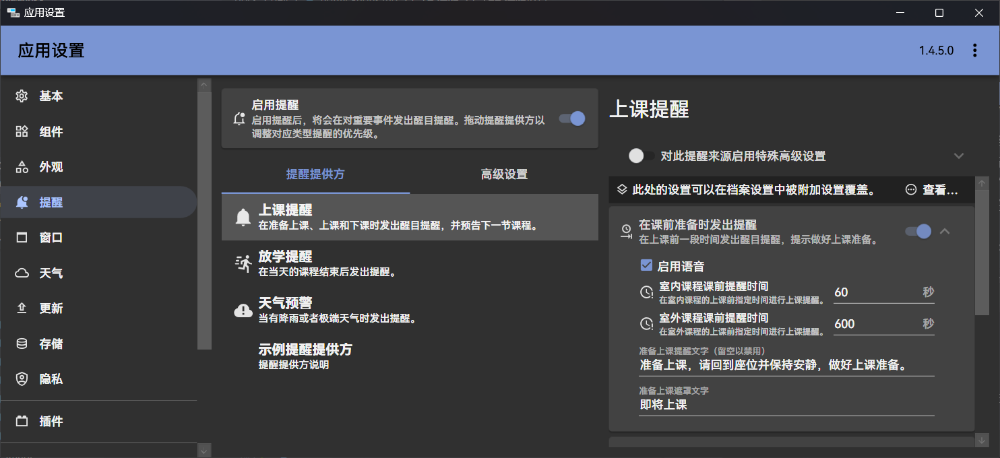
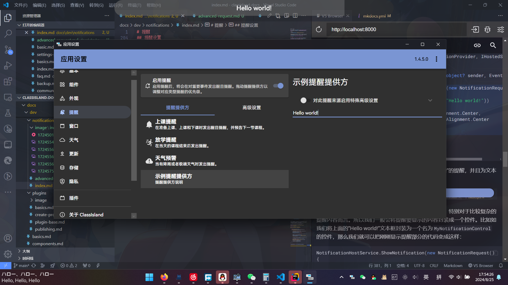

# 提醒

本文主要讲述如何注册提醒提供方、添加提醒设置界面和发送提醒。

!!! info
    这篇文章主要讲述如何开发提醒。如果您只是要调整提醒设置的普通用户，请参考[这篇文章](../app/notifications.md)。

<!-- ??? note "演示视频"
    <video src="../image/index/1724501396690.mp4" muted controls loop></video> -->

提醒是 ClassIsland 中用于展示重要信息的功能，可以通过全屏特效、语音、音效等方式增强提醒效果。提醒由提醒提供方发出，由提醒主机管理提醒和提醒提供方，最终由主界面展示。

!!! example
    注册提醒提供方的完整示例代码可以在[示例插件仓库](https://github.com/ClassIsland/ExamplePlugins/tree/master/PluginWithNotificationProviders)上查看。

## 注册提醒提供方

提醒提供方是一个实现`INotificationProvider`接口的托管服务（`IHostService`），会在应用主机启动后自动启动。

要注册提醒提供方，我们首先需要创建一个实现了`INotificationProvider`和`IHostedService`的提醒提供方类。如下方代码所示，

``` csharp title="Services/NotificationProviders/MyNotificationProvider.cs"
using ClassIsland.Core.Abstractions.Services;
using ClassIsland.Shared.Interfaces;
using Microsoft.Extensions.Hosting;

namespace PluginWithNotificationProviders.Services.NotificationProviders;

public class MyNotificationProvider : INotificationProvider, IHostedService
{
    public string Name { get; set; } = "示例提醒提供方";
    public string Description { get; set; } = "提醒提供方说明";
    public Guid ProviderGuid { get; set; } = new Guid("DD3BC389-BEA9-40B7-912B-C7C37390A101");
    public object? SettingsElement { get; set; }
    public object? IconElement { get; set; }

    public async Task StartAsync(CancellationToken cancellationToken)
    {
    }

    public async Task StopAsync(CancellationToken cancellationToken)
    {
    }
}
```

上面的代码内容可能有点多，不用害怕，我们一点一点来看。

代码中的`ProviderGuid`属性是用于区分提醒提供方的唯一 ID，您可以使用 Visual Studio 自带的 GUID 生成器或者 Resharper/Rider 的 `nguid` 缩写快速创建一个 GUID。

`Name`和`Description`属性分别是提醒提供方名称和描述，这些信息会在提醒设置中显示。

接下来我们需要把这个提醒提供方注册到提醒主机上。添加以下高亮代码：

``` csharp title="Services/NotificationProviders/MyNotificationProvider.cs" hl_lines="9-15"
// ...

namespace PluginWithNotificationProviders.Services.NotificationProviders;

public class MyNotificationProvider : INotificationProvider, IHostedService
{
    // ...

    private INotificationHostService NotificationHostService { get; }

    public MyNotificationProvider(INotificationHostService notificationHostService)
    {
        NotificationHostService = notificationHostService;
        NotificationHostService.RegisterNotificationProvider(this);
    }

    // ...
}

// ...
```

在上面的代码中，高亮的部分属于这个提醒提供方的构造函数。我们在构造函数的参数中获取了提醒主机服务，然后把提醒主机服务保存到一个名为`NotificationHostService`的只读属性中备用。接着我们调用了提醒主机服务的`RegisterNotificationProvider`方法，将这个提醒提供方注册到了提醒主机上。

接着我们还需要在[插件初始化方法](./plugins/plugin-base.md#初始化方法)，或应用主机配置方法中添加以下代码，将这个提醒提供方注册到应用主机上。

```csharp
services.AddHostedService<MyNotificationProvider>();
```

上面的代码将这个提醒提供方作为托管服务注册到了应用主机上，这样这个提醒提供方服务就会在应用启动时自动启动，同时也会在提醒设置中显示。



此外，也可以通过设置`IconElement`属性来指定提醒提供方图标元素。提醒提供方会在提醒设置中显示。`IconElement`属性可以是任意一个可以作为图标的 WPF 控件，比如 PackIcon、Image 等等。以下面的代码为例：

``` csharp
IconElement = new PackIcon()
{
    Kind = PackIconKind.TextLong,
    Width = 24,
    Height = 24
};
```

上面的代码将图标元素设置为类型为`TextLong`的 PackIcon，在提醒设置界面的效果如下图所示：



## 显示提醒

注册好提醒主机后，我们的提醒主机就可以发送提醒了。您可以通过订阅您感兴趣的事件（如[上课事件](./events.md#上课事件)、[下课事件](./events.md#下课事件)等），在合适的时机显示提醒。

### 组成

一个提醒由以下部分组成：

- **遮罩（Mask）**：提醒进入时显示的内容，使用主题色作为背景，一般用于吸引注意力和总结提醒内容。
    
- **正文（Overlay）_（可选）_**：遮罩显示结束后，显示的提醒正文。如果没有正文内容


### 订阅事件

我们以在下课时显示提醒为例，添加以下代码获取课程服务，并订阅[下课事件](./events.md#下课事件)：

``` csharp title="Services/NotificationProviders/MyNotificationProvider.cs" hl_lines="8 11 14 17 20-23"
// ...

namespace PluginWithNotificationProviders.Services.NotificationProviders;

public class MyNotificationProvider : INotificationProvider, IHostedService
{
    private INotificationHostService NotificationHostService { get; }
    public ILessonsService LessonsService { get; }

    public MyNotificationProvider(INotificationHostService notificationHostService,
     ILessonsService lessonsService)
    {
        NotificationHostService = notificationHostService;
        LessonsService = lessonsService;  // 将课程服务实例保存到属性中备用
        NotificationHostService.RegisterNotificationProvider(this);
        
        LessonsService.OnBreakingTime += LessonsServiceOnOnBreakingTime;  // 注册下课事件
    }

    private void LessonsServiceOnOnBreakingTime(object? sender, EventArgs e)
    {
    
    }

    // ...
}
```

上面高亮的代码通过在构造函数中添加课程服务参数，获取了课程服务实例，并保存到`LessonsService`属性中备用。接着订阅了[下课事件](./events.md#下课事件)`OnBreakingTime`的事件处理程序`LessonsServiceOnOnBreakingTime`。当下课时，事件处理程序`LessonsServiceOnOnBreakingTime`中的代码就会被调用。

### 提醒请求

显示提醒需要通过提醒主机的`ShowNotification`方法，并在参数传入提醒请求（`NotificationRequest`）。此外，使用此方法的异步重载`ShowNotificationAsync`可以等待提醒显示完毕。

!!! warning
    `ShowNotification`和`ShowNotificationAsync`方法**必须**从对应的提醒提供方调用，否则会引发异常。

以下是几个比较常用的提醒请求属性，其它属性也将在文章后续介绍。完整的提醒请求属性请见[源代码文档](https://github.com/ClassIsland/ClassIsland/blob/master/ClassIsland.Shared/Models/Notification/NotificationRequest.cs)。

| 属性名 | 类型 | 必填？ | 说明 |
| -- | -- | -- | -- |
| MaskContent | `object` | **是** | 提醒遮罩内容，在提醒进入时显示。 |
| MaskDuration | `TimeSpan` | 否 | 提醒遮罩显示时长，默认为 5 秒。|
| OverlayContent | `object` | 否 | 提醒正文内容。 |
| OverlayDuration | `TimeSpan` | 否 | 提醒正文显示时长，默认为 5 秒。|

下面是一个调用`ShowNotification`方法显示提醒的示例：

``` csharp
NotificationHostService.ShowNotification(new NotificationRequest()
{
    MaskContent = new TextBlock(new Run("Hello world!"))
    {
        VerticalAlignment = VerticalAlignment.Center,
        HorizontalAlignment = HorizontalAlignment.Center
    }
});
```

我们可以把这段代码添加到下课事件的事件处理程序中：

``` csharp title="Services/NotificationProviders/MyNotificationProvider.cs" hl_lines="9-16"
// ...
namespace PluginWithNotificationProviders.Services.NotificationProviders;

public class MyNotificationProvider : INotificationProvider, IHostedService
{
    // ...
    private void LessonsServiceOnOnBreakingTime(object? sender, EventArgs e)
    {
        NotificationHostService.ShowNotification(new NotificationRequest()
        {
            MaskContent = new TextBlock(new Run("Hello world!"))
            {
                VerticalAlignment = VerticalAlignment.Center,
                HorizontalAlignment = HorizontalAlignment.Center
            }
        });
    }
    // ...
}
```

上面的代码会在下课时显示一个遮罩为文本“Hello world!”的提醒，并且为文本设置了水平和竖直居中的属性。效果如下图：



显然，在代码中手动初始化控件不是一件很容易的事情，特别对于比较复杂的提醒内容而言。所以我们一般会将提醒要显示的内容封装成一个控件。比如如我们将上面的“Hello world!”文本框封装为一个名为`MyNotificationControl`的控件，那么我们就可以把刚刚显示提醒部分的代码变成这样：

``` csharp
NotificationHostService.ShowNotification(new NotificationRequest()
{
    MaskContent = new MyNotificationControl()
});
```

## 提醒设置

一般情况下，提醒提供方会提供一些可以调节的设置选项，如下图：



接下来我们会给我们的提醒提供方添加一个设置界面，并允许用户自定义提醒显示的内容。

新建提醒设置类`MyNotificationSettings`，用于存储我们的设置：

``` csharp title="Models/MyNotificationSettings.cs"
using CommunityToolkit.Mvvm.ComponentModel;

namespace PluginWithNotificationProviders.Models;

public class MyNotificationSettings : ObservableRecipient
{
    private string _message = "";

    /// <summary>
    /// 要显示的文本
    /// </summary>
    public string Message
    {
        get => _message;
        set
        {
            if (value == _message) return;
            _message = value;
            OnPropertyChanged();
        }
    }
}
```

上面的代码定义了一个名为`MyNotificationSettings`的属性，包含了`Message`属性，用来存储自定义的消息内容。

此外，我们还需要使用提醒主机的`GetNotificationProviderSettings`方法来获取提醒的设置。在我们的提醒提供方中添加下方高亮代码：

``` csharp title="Services/NotificationProviders/MyNotificationProvider.cs" hl_lines="8-11 20-21"
// ...
namespace PluginWithNotificationProviders.Services.NotificationProviders;

public class MyNotificationProvider : INotificationProvider, IHostedService
{
    // ...
    
    /// <summary>
    /// 这个属性用来存储提醒的设置。
    /// </summary>
    private MyNotificationSettings Settings { get; }

    public MyNotificationProvider(INotificationHostService notificationHostService,
        ILessonsService lessonsService)
    {
        NotificationHostService = notificationHostService;
        LessonsService = lessonsService;
        NotificationHostService.RegisterNotificationProvider(this);

        // 获取这个提醒提供方的设置，并保存到 Settings 属性上备用。
        Settings = NotificationHostService.GetNotificationProviderSettings<MyNotificationSettings>(ProviderGuid);
        
        LessonsService.OnBreakingTime += LessonsServiceOnOnBreakingTime;
    }
    // ...
}
```

上面高亮的代码通过当前提醒提供方的 GUID，从提醒主机获得了当前提醒提供方的设置，并保存到了 Settings 属性上备用。这样我们就可以在提醒提供方中访问提醒设置了，并且提醒设置也会在保存应用设置时一并保存。

接着修改下课的事件处理程序，在提醒请求部分的代码中添加`OverlayContent`属性，以在提醒正文中显示可以在提醒设置中自定义的文本。

``` csharp title="Services/NotificationProviders/MyNotificationProvider.cs" hl_lines="15-19"
namespace PluginWithNotificationProviders.Services.NotificationProviders;

public class MyNotificationProvider : INotificationProvider, IHostedService
{
    // ...
    private void LessonsServiceOnOnBreakingTime(object? sender, EventArgs e)
    {
        NotificationHostService.ShowNotification(new NotificationRequest()
        {
            MaskContent = new TextBlock(new Run("Hello world!"))
            {
                VerticalAlignment = VerticalAlignment.Center,
                HorizontalAlignment = HorizontalAlignment.Center
            },
            OverlayContent = new TextBlock(new Run(Settings.Message))
            {
                VerticalAlignment = VerticalAlignment.Center,
                HorizontalAlignment = HorizontalAlignment.Center
            },
        });
    }
    // ...
}
```

上面的代码将`OverlayContent`也设置为了一个竖直和水平都居中的文本框，并使用提醒提供方设置中的`Message`属性作为显示内容。这样显示提醒时，就可以显示我们自定义的文本。

接着我们需要创建提醒设置界面，以调整要自定义显示的文本。添加以下代码：

=== ":octicons-file-code-16: `Controls/NotificationProviders/MyNotificationProviderSettingsControl.xaml`"

    ``` xml
    <UserControl x:Class="PluginWithNotificationProviders.Controls.NotificationProviders.MyNotificationProviderSettingsControl"
             xmlns="http://schemas.microsoft.com/winfx/2006/xaml/presentation"
             xmlns:x="http://schemas.microsoft.com/winfx/2006/xaml"
             xmlns:mc="http://schemas.openxmlformats.org/markup-compatibility/2006"
             xmlns:d="http://schemas.microsoft.com/expression/blend/2008"
             xmlns:local="clr-namespace:PluginWithNotificationProviders.Controls.NotificationProviders"
             mc:Ignorable="d"
             d:DesignHeight="300" d:DesignWidth="300">
        <StackPanel DataContext="{Binding RelativeSource={RelativeSource FindAncestor, AncestorType=local:MyNotificationProviderSettingsControl}}">
            <TextBox Text="{Binding Settings.Message}"/>
        </StackPanel>
    </UserControl>

    ```

=== ":octicons-file-code-16: `Controls/NotificationProviders/MyNotificationProviderSettingsControl.xaml.cs`"

    ``` csharp
    using System.Windows.Controls;
    using PluginWithNotificationProviders.Models;

    namespace PluginWithNotificationProviders.Controls.NotificationProviders;

    public partial class MyNotificationProviderSettingsControl : UserControl
    {
        /// <summary>
        /// 这个属性用来存储提醒提供方设置
        /// </summary>
        public MyNotificationSettings Settings { get; }
        
        // 这里通过构造函数参数传入设置对象，这样设置控件就可以访问到提醒提供方的设置了。
        public MyNotificationProviderSettingsControl(MyNotificationSettings settings)
        {
            // 将设置对象写入到属性中，这样前端就可以访问到这个设置对象，以进行绑定。
            Settings = settings;
            
            InitializeComponent();
        }
    }
    ```

然后我们还需要将我们的提醒提供方中的`SettingsControl`属性设置为我们刚刚的控件，这样在提醒设置中，我们的提醒提供方的设置界面就会显示我们刚刚定义的提醒设置控件。添加如下高亮代码：

``` csharp title="Services/NotificationProviders/MyNotificationProvider.cs" hl_lines="17-19"
// ...
namespace PluginWithNotificationProviders.Services.NotificationProviders;

public class MyNotificationProvider : INotificationProvider, IHostedService
{
    // ...
    public MyNotificationProvider(INotificationHostService notificationHostService,
        ILessonsService lessonsService)
    {
        NotificationHostService = notificationHostService;
        LessonsService = lessonsService;
        NotificationHostService.RegisterNotificationProvider(this);
        
        // 获取这个提醒提供方的设置，并保存到 Settings 属性上备用。
        Settings = NotificationHostService.GetNotificationProviderSettings<MyNotificationSettings>(ProviderGuid);

        // 将刚刚获取到的提醒提供方设置传给提醒设置控件，这样提醒设置控件就可以访问到提醒设置了。
        // 然后将 SettingsElement 属性设置为这个控件对象，这样提醒设置界面就会显示我们自定义的提醒设置控件。
        SettingsElement = new MyNotificationProviderSettingsControl(Settings);
        
        LessonsService.OnBreakingTime += LessonsServiceOnOnBreakingTime;
    }   
    // ...
}
```

完成上面步骤之后，打开提醒设置，可以看到提醒设置部分出现了我们在提醒设置控件中定义的文本框，同时在下课时也会在提醒正文中显示文本框中的内容。



## 提醒语音

要让显示的提醒支持语音播报，需要在提醒请求手动设置`MaskSpeechContent`和`OverlayOverlaySpeechContent`属性。这两个属性分别设定了在显示遮罩时和显示正文时语音播报的文本。您可以将这两个属性直接设置为提醒上显示的文本，也可以设置为提醒内容的总结。

!!! warning
    在提醒显示结束后，没有朗读完的内容将被截断，请注意控制朗读内容时长。

修改提醒提供方的下课事件处理程序，在提醒请求中添加下方高亮代码：

``` csharp title="Services/NotificationProviders/MyNotificationProvider.cs" hl_lines="20-22"
namespace PluginWithNotificationProviders.Services.NotificationProviders;

public class MyNotificationProvider : INotificationProvider, IHostedService
{
    // ...
    private void LessonsServiceOnOnBreakingTime(object? sender, EventArgs e)
    {
        NotificationHostService.ShowNotification(new NotificationRequest()
        {
            MaskContent = new TextBlock(new Run("Hello world!"))
            {
                VerticalAlignment = VerticalAlignment.Center,
                HorizontalAlignment = HorizontalAlignment.Center
            },
            OverlayContent = new TextBlock(new Run(Settings.Message))
            {
                VerticalAlignment = VerticalAlignment.Center,
                HorizontalAlignment = HorizontalAlignment.Center
            },
            // 下面两个属性设置了语音播报的内容。
            MaskSpeechContent = "Hello world!",
            OverlaySpeechContent = Settings.Message,
        });
    }
    // ...
}
```

上面高亮的代码中，我们将显示遮罩时播报的内容设置为“Hello world!”，将显示正文时播报的内容设置为在提醒设置中设置的自定义消息。
