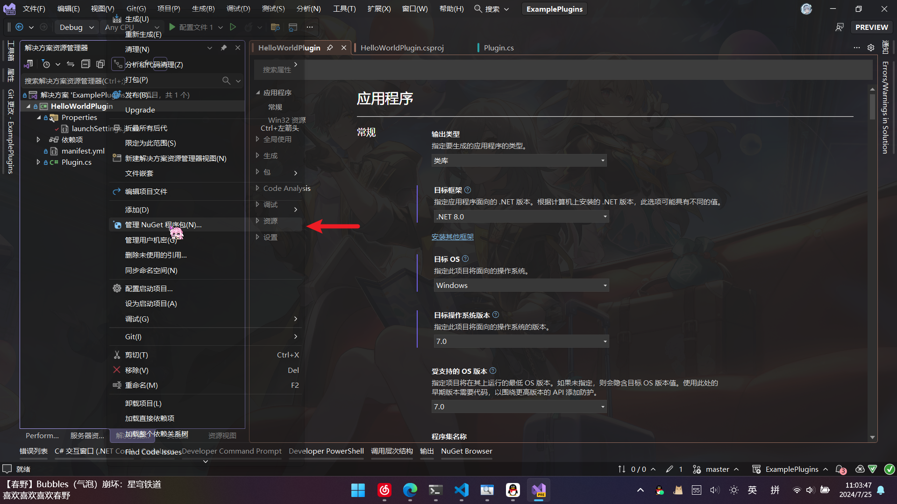
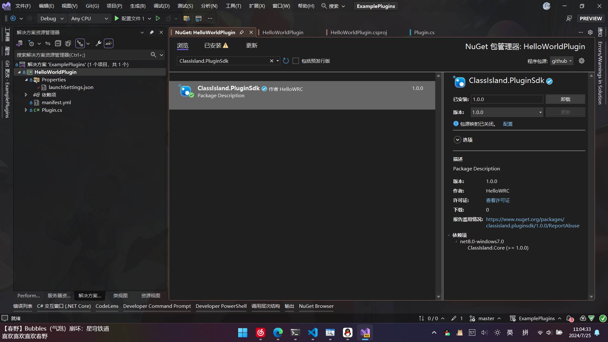
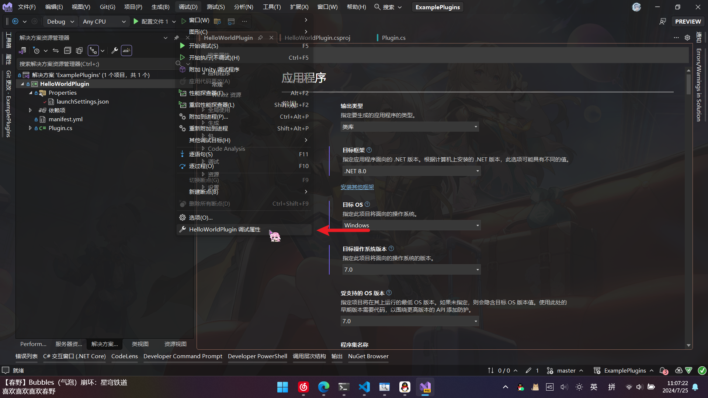
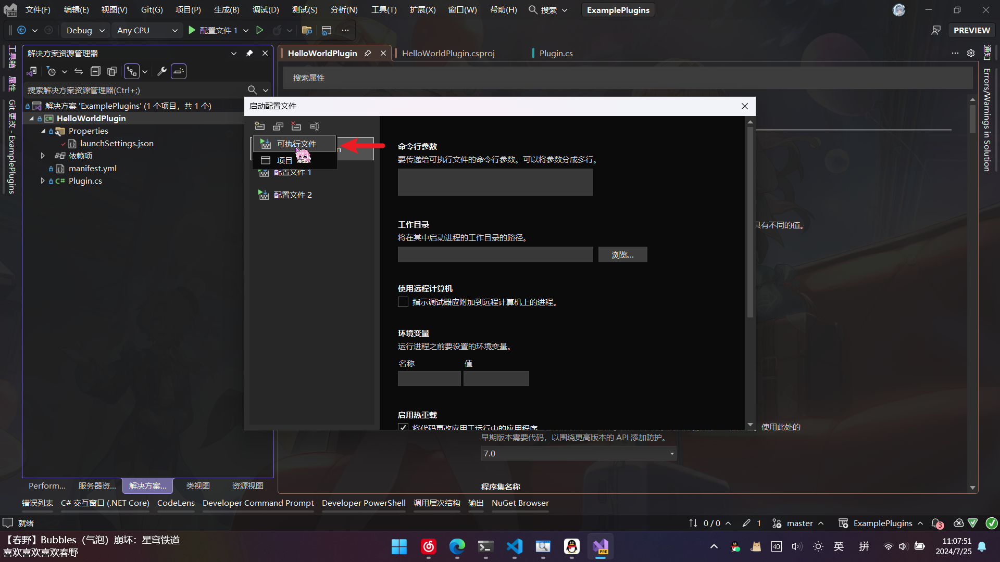
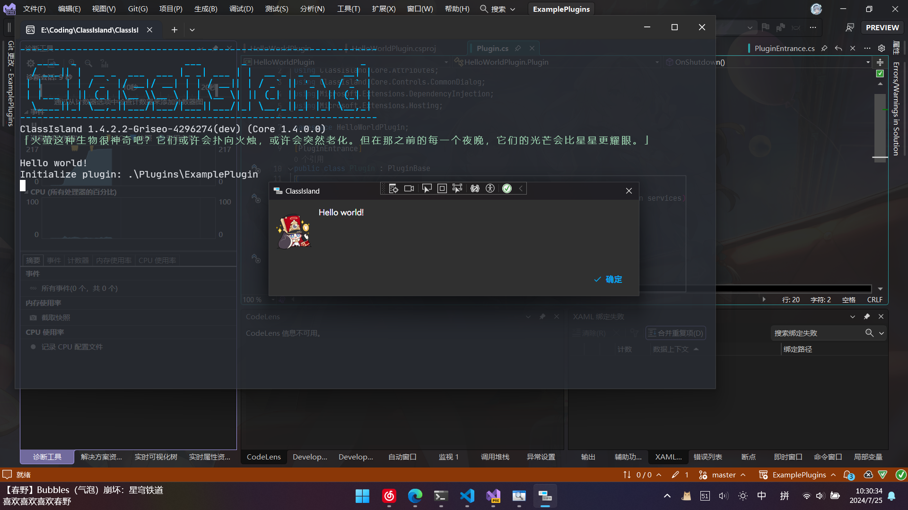

# 开始编写插件

本文章将介绍如何创建、调试并运行 ClassIsland 的插件项目。

!!! warning
    本文章所涉及内容仍在开发中，随时可能发生变动。请注意关注文档更变。

在开始之前，您需要按照[设置 ClassIsland 插件开发环境](../get-started/devlopment-plugins.md)的指引设置插件开发环境。

## 使用模板

您可以使用项目模板快速开始开发。

!!! info "待补充。"

## 手动创建项目

以下步骤以在 Visual Studio 2022 中的操作为例。

1. 创建一个模板为【WPF 类库】的项目，选择【.NET 8】目标框架
2. 项目创建完成后，在【解决方案资源管理器】中右键项目，在弹出的操作菜单中点击【管理 Nuget 程序包…】操作。

    

3. 搜索并安装包【ClassIsland.PluginSdk】。

    

    !!! warning
        目前 ClassIsland 插件相关的 SDK 还未在 nuget.org 上发布。您需要按照[此文章](https://docs.github.com/zh/authentication/keeping-your-account-and-data-secure/managing-your-personal-access-tokens)的方法创建 GitHub 个人访问令牌（classic），并至少赋予 `read:packages` 权限。然后使用以下命令添加 ClassIsland 的 GitHub Packages Nuget 源：

        ``` shell
        dotnet nuget add source --username（你的用户名） --password（你的 GitHub 个人访问令牌） --store-password-in-clear-text --name github "https://nuget.pkg.github.com/ClassIsland/index.json"
        ```

4. 打开项目文件，添加 `EnableDynamicLoading` 属性以允许插件被动态加载，并在 `ClassIsland.PluginSdk` 的引用项上设置`ExcludeAssets` 属性为 `runtime` 以阻止插件 SDK 相关依赖项流入构建结果。

    ```xml title="MyPlugin.csproj" hl_lines="9 13"
    <Project Sdk="Microsoft.NET.Sdk">

        <PropertyGroup>
            <TargetFramework>net8.0-windows</TargetFramework>
            <Nullable>enable</Nullable>
            <UseWPF>true</UseWPF>
            <ImplicitUsings>enable</ImplicitUsings>
            <PlatformTarget>x64</PlatformTarget>
            <EnableDynamicLoading>True</EnableDynamicLoading>
        </PropertyGroup>
        <ItemGroup>
            <PackageReference Include="ClassIsland.PluginSdk" Version="1.0.0">
                <ExcludeAssets>runtime</ExcludeAssets>
            </PackageReference>
        </ItemGroup>
    </Project>

    ```

## 插件清单文件

插件清单文件包含了插件的基本信息，如插件入口程序集等。

在项目目录下创建名为 `manifest.yml` 的文件，并在【属性】中将【复制到输出目录】属性设置为【如果较新则复制】。这样在构建时插件清单文件会被自动复制到输出目录。

清单文件具有以下属性：

| 属性名 | 类型 | 必填？ | 说明 |
| -- | -- | -- | -- |
| id | `string` | **是** | 插件的唯一 id |
| entranceAssembly | `string` | **是** | 插件入口程序集。在加载插件时将从这个程序集中查找插件入口点。 |
| name | `string` | 否 | 插件显示名称 |
| description | `string` | 否 | 插件描述 |
| url | `string` | 否 | 插件主页 Url |
| icon | `string` | 否 | 插件图标文件名，默认值为`icon.png` |
| readme | `string` | 否 | 插件自述文件文件名，默认为`README.md` |

以下是一个清单文件的示例：

```yaml title="manifest.yml"
id: examples.helloworld  # 插件 id
name: Hello world!  # 插件名称
description: 在启动时弹出一个“Hello world”提示框。  # 插件描述
entranceAssembly: "HelloWorldPlugin.dll"  # 插件入口程序集
url: https://github.com/ClassIsland/ExamplePlugins  # 插件 Url
```

## 插件入口点

加载插件时，将从清单文件标记的入口程序集中查找以 `ClassIsland.Core.Abstractions.PluginBase` 为基类，且带有 `ClassIsland.Core.Attributes.PluginEntrance` 属性的类作为插件入口点，并调用 `Initialize` 方法运行插件自定义的初始化函数。

创建一个名为 `Plugin` 的类，继承 `ClassIsland.Core.Abstractions.PluginBase` ，并为类添加 `ClassIsland.Core.Attributes.PluginEntrance` 属性。

```csharp title="Plugin.cs"
using ClassIsland.Core.Abstractions;
using ClassIsland.Core.Attributes;
using ClassIsland.Core.Controls.CommonDialog;
using Microsoft.Extensions.DependencyInjection;
using Microsoft.Extensions.Hosting;

namespace HelloWorldPlugin;

[PluginEntrance]
public class Plugin : PluginBase
{
    public override void Initialize(HostBuilderContext context, IServiceCollection services)
    {
    }

    public override void OnShutdown()
    {
    }
}
```

然后为初始化方法 `Initialize` 方法添加如下语句，以在加载插件时显示“Hello world!”提示框。

```csharp title="Plugin.cs" hl_lines="9"
// ...
namespace HelloWorldPlugin;

[PluginEntrance]
public class Plugin : PluginBase
{
    public override void Initialize(HostBuilderContext context, IServiceCollection services)
    {
        CommonDialog.ShowInfo("Hello world!");
    }

    // ...
}
```

!!! tip
    您还可以在 `Initialize` 中完成相关服务的注册，详细信息请见[此文章](../basics.md#依赖注入)。

## 配置主题

在插件中引入控件样式需要指定默认主题字典。

新建 `AssemblyInfo.cs`，并写入以下内容，指定主题资源字典的位于当前程序集：

``` csharp title="AssemblyInfo.cs"
using System.Windows;

[assembly: ThemeInfo(
    ResourceDictionaryLocation.None, 
    ResourceDictionaryLocation.SourceAssembly
)]
```

!!! note
    关于此属性的详细用法，请见[文档](https://learn.microsoft.com/zh-cn/dotnet/api/system.windows.themeinfoattribute?view=windowsdesktop-8.0)。

创建 `Theme/Generic.xaml`，并写入以下内容，引用主题资源字典：

``` xml title="Themes/Generic.xaml"
<ResourceDictionary xmlns="http://schemas.microsoft.com/winfx/2006/xaml/presentation"
                    xmlns:x="http://schemas.microsoft.com/winfx/2006/xaml">
    <ResourceDictionary.MergedDictionaries>
        <ResourceDictionary Source="pack://application:,,,/ClassIsland.Core;;;component/ThemeBase.xaml"/>
    </ResourceDictionary.MergedDictionaries>
</ResourceDictionary>
```

## 配置启动项目

需要以 ClassIsland 本体为载体以运行和调试插件。

=== "Visual Studio"

    1. 进入【调试】->【（项目名）调试属性】，打开【启动配置文件】窗口。

        

    2. 新建【可执行文件】启动项目。

        

    3. 在【可执行文件】一栏中填写在[配置插件开发环境](../get-started/devlopment-plugins.md#克隆并构建-classisland)中构建的 ClassIsland 可执行文件路径
    4. 将【工作目录】一栏设置为 ClassIsland 可执行文件路径的文件夹。
    5. 在【命令行参数】一栏填入以下命令行参数，让 ClassIsland 启动时从当前插件的输出目录中加载插件：

        ```plaintext
        -epp（你当前插件项目的输出目录，如 E:\Coding\ExamplePlugins\HelloWorldPlugin\bin\Debug\net8.0-windows）
        ```

        

=== "手动编辑 `launchSettings.json`"

    向 `launchSettings.json` 中添加下述内容：

    ``` json title="launchSettings.json" hl_lines="4-9"
    {
        "profiles": {
            // ...
            "配置文件 1": {
                "commandName": "Executable",
                "executablePath": "...",  // (1)
                "commandLineArgs": "-epp ...",  // (2)
                "workingDirectory": "..."  // (3)
            }
        }
    }
    ```

    1. 将这里替换为在[配置插件开发环境](../get-started/devlopment-plugins.md#克隆并构建-classisland)中构建的 ClassIsland 可执行文件路径。
    2. 将参数替换为你当前插件项目的输出目录，如 `E:\\Coding\\ExamplePlugins\\HelloWorldPlugin\\bin\\Debug\\net8.0-windows`
    3. 将这里替换为[配置插件开发环境](../get-started/devlopment-plugins.md#克隆并构建-classisland)中构建的 ClassIsland 可执行文件路径的文件夹。

以上配置步骤完成后，关闭【启动配置文件】窗口，然后切换到刚刚添加的启动配置文件，启动调试。如果没有差错，您可以看到 ClassIsland 正常启动，并弹出了由插件显示的提示框。



🎉恭喜！您成功创建了您的第一个插件！

## 继续深入

您可以继续阅读文章来进一步了解相关 API 的用法，或者查看 GitHub 上的 [插件示例](https://github.com/ClassIsland/ExamplePlugins)。
