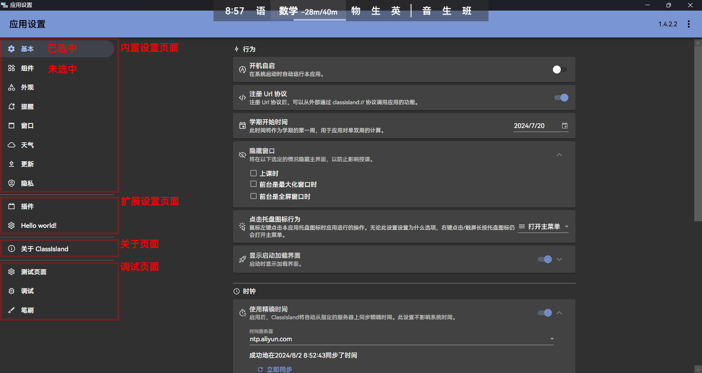

# 设置页面

ClassIsland 允许插件在设置窗口注册自定义的设置页面。本文将主要介绍如何创建和注册自定义的设置页面。

## 创建设置页面

设置页面基于 WPF 内置的页面类型，所以我们需要先创建一个页面。创建好页面之后，更改以下高亮内容，将页面的基类修改为 `SettingsPageBase`。

```xml title="ExampleSettingsPage.xaml" hl_lines="1 4"
<ci:SettingsPageBase 
      x:Class="PluginWithSettingsPage.Views.SettingsPages.ExampleSettingsPage"
      xmlns="http://schemas.microsoft.com/winfx/2006/xaml/presentation"
      xmlns:ci="http://classisland.tech/schemas/xaml/core"
      xmlns:x="http://schemas.microsoft.com/winfx/2006/xaml"
      xmlns:mc="http://schemas.openxmlformats.org/markup-compatibility/2006" 
      xmlns:d="http://schemas.microsoft.com/expression/blend/2008" 
      xmlns:local="clr-namespace:PluginWithSettingsPage.Views.SettingsPages"
      mc:Ignorable="d" 
      d:DesignHeight="450" d:DesignWidth="800"
      Title="ExampleSettingsPage">
    <Grid/>
</ci:SettingsPageBase>
```

```cs title="ExampleSettingsPage.xaml.cs" hl_lines="5"
using ClassIsland.Core.Attributes;

namespace PluginWithSettingsPage.Views.SettingsPages;

public partial class ExampleSettingsPage : SettingsPageBase
{
    public ExampleSettingsPage()
    {
        InitializeComponent();
    }
}
```

为了应用主题样式，还要向设置页面添加下方高亮的属性：

```xml title="ExampleSettingsPage.xaml" hl_lines="11-17"
<ci:SettingsPageBase x:Class="PluginWithSettingsPage.Views.SettingsPages.ExampleSettingsPage"
      xmlns="http://schemas.microsoft.com/winfx/2006/xaml/presentation"
      xmlns:x="http://schemas.microsoft.com/winfx/2006/xaml"
      xmlns:mc="http://schemas.openxmlformats.org/markup-compatibility/2006" 
      xmlns:d="http://schemas.microsoft.com/expression/blend/2008" 
      xmlns:local="clr-namespace:PluginWithSettingsPage.Views.SettingsPages"
      xmlns:ci="http://classisland.tech/schemas/xaml/core"
      mc:Ignorable="d" 
      d:DesignHeight="450" d:DesignWidth="800"
      Title="ExampleSettingsPage"
      TextElement.Foreground="{DynamicResource MaterialDesignBody}"
      Background="{DynamicResource MaterialDesignPaper}"
      FontFamily="{StaticResource HarmonyOsSans}"
      TextElement.FontWeight="Regular"
      TextElement.FontSize="14"
      TextOptions.TextFormattingMode="Ideal"
      TextOptions.TextRenderingMode="Auto"
      d:DataContext="{d:DesignInstance local:ExampleSettingsPage}">
    <!-- ... -->
</ci:SettingsPageBase>
```

## 声明页面信息

此外，为了声明设置页面信息，我们还需要向设置页面的后端代码中添加 `SettingsPageInfo` 属性：

```cs title="ExampleSettingsPage.xaml.cs" hl_lines="5"
using ClassIsland.Core.Attributes;

namespace PluginWithSettingsPage.Views.SettingsPages;

[SettingsPageInfo("examples.exampleSettingsPage", "示例设置页面")]
public partial class ExampleSettingsPage : SettingsPageBase
{
    public ExampleSettingsPage()
    {
        InitializeComponent();
    }
}
```

您可以在 `SettingsPageInfo` 属性中为设置页面指定图标、类别等信息，例如：

```cs
[SettingsPageInfo(
    "examples.exampleSettingsPage",   // 设置页面 id
    "示例设置页面",  // 设置页面名称
    PackIconKind.CogOutline,   // 未选中时设置页面图标
    PackIconKind.Cog,  // 选中时设置页面图标
    SettingsPageCategory.External  // 设置页面类别
)]
```

您也可以在 `SettingsPageInfo` 属性中指定设置页面的类别。不同的设置页面类别的设置页面会在分组后按一定的顺序显示。设置页面具有以下类别：

| 值 | 类别 | 说明 |
| -- | -- | -- |
| SettingsPageCategory.Internal | 内部设置页面 | ClassIsland 内置的设置页面，不建议插件注册的设置页面使用此类别。 |
| SettingsPageCategory.External | 扩展设置页面 | 一般用于插件注册设置页面。 |
| SettingsPageCategory.About | 关于页面 | 显示关于信息的设置页面。 |
| SettingsPageCategory.Debug | 调试页面 | 用于调试的页面，当调试菜单关闭时，不会显示这些界面。 |

这些类别在设置界面上显示的位置如下示意图所示：



## 注册设置页面

编写完设置界面之后，还需要在初始化方法中把设置页面注册到应用上。

=== "在插件中注册"

    在插件的入口点添加以下高亮代码：

    ```cs title="Plugin.cs" hl_lines="11"
    // ...
    namespace PluginWithSettingsPage;

    [PluginEntrance]
    public class Plugin : PluginBase
    {
        public Settings Settings { get; set; } = new();

        public override void Initialize(HostBuilderContext context, IServiceCollection services)
        {
            services.AddSettingsPage<ExampleSettingsPage>();
        }

        public override void OnShutdown()
        {
        }
    }
    ```

    上面高亮的代码利用 `AddSettingsPage` 扩展方法将设置页面注册到了应用主机上。

=== "在应用中注册"

    在应用的初始化方法中添加以下高亮代码：

    ```cs title="App.xaml.cs" hl_lines="15"
    // ...
    namespace ClassIsland;
    
    class App : AppBase {
        // ...
        private void App_OnDispatcherUnhandledException(object sender, DispatcherUnhandledExceptionEventArgs e)
        {
            // ...
            IAppHost.Host = Microsoft.Extensions.Hosting.Host.
            CreateDefaultBuilder().
            UseContentRoot(AppContext.BaseDirectory).
            ConfigureServices((context, services) =>
            {
                // ...
                services.AddSettingsPage<ExampleSettingsPage>();
                // ...
            }
            );
            // ...
        }
        // ...
    }  
    ```

注册完成后，打开【应用设置】，您可以在设置界面的导航栏中看到您注册的设置页面。

您可以查看[设置界面示例](https://github.com/ClassIsland/ExamplePlugins/tree/master/PluginWithSettingsPage)项目来了解更多信息。
