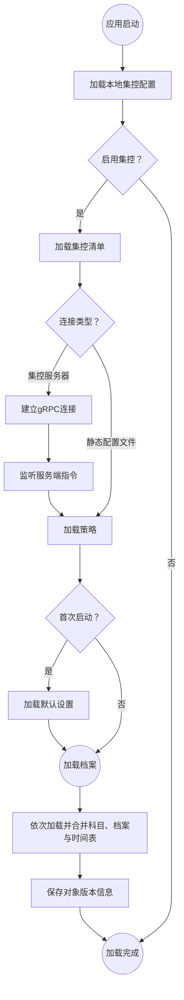

# 集控

学校/组织的IT可以通过集控功能向学校内的ClassIsland实例统一分发课表、时间表和科目等信息，并且可以集中调整软件设置和限制部分功能的使用，提高管理的便利性。

## 开始使用

本功能支持通过静态配置文件部署，也可以通过管理服务器部署。您可以根据情况自由选择部署方式。

### 使用静态配置文件

您可以手动编写集控配置文件，并将其托管到静态网站上。

[🚀入门教程](tutorial-create-management-config)

[📖参考文档](configure)

### 集控服务器

_🚧正在开发_

### 选哪个？

(WIP)

## 连接到集控服务器

在部署好配置文件/集控服务器后，您还需要将 ClassIsland 实例连接到集控服务器。

ClassIsland 从[集控配置文件](configure#集控配置)加载集控的相关设置。在编写好集控配置文件后，在【应用设置】->【更多选项（右上角三个点）】->【加入管理…】即可加载配置文件并连接到集控服务。

您也可以在首次运行应用时，点击欢迎向导首页右下角【加入管理】按钮打开加入集控的界面。

将集控配置后重命名为`ManagementPreset.json`，并放置于应用目录下，即可在加入集控时自动选择并加载集控配置文件。

## 客户端识别

您可以为每个ClassIsland实例自定义一个id，来标识每个实例。您可以将自定义id设置为班级名、教室编号等易于识别的名称。

除了自定义的id外，ClassIsland还会生成一段唯一客户端id（CUID），来标识每个实例。

这些信息可以在访问集控配置数据时，加入到url中。详细请见[url模板](configure#url模板)。

## 加载流程

集控相关配置会按照以下流程进行加载，展开以查看详细信息。

展开流程图

获取到的配置文件（如清单、策略、课表等）会缓存在本地，并只在有更新时才会重新获取。在启用集控后，将强制加载管理档案，与普通档案不互通数据。

## 退出集控

要退出集控，点击【应用设置】->【更多选项（右上角三个点）】->【退出集控…】即可退出集控。

!!! note "如果要禁用集控退出功能，可以在集控策略中将`AllowExitManagement`设置为`false`。[详细信息]()"