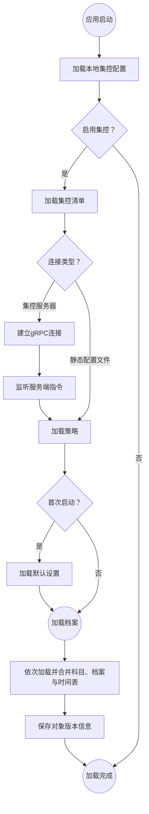

# 集控

学校/组织的 IT 可以通过集控功能向学校内的 ClassIsland 实例统一分发课表、时间表和科目等信息，并且可以集中调整软件设置和限制部分功能的使用，提高管理的便利性。

## 开始使用

本功能支持通过静态配置文件部署，也可以通过管理服务器部署。您可以根据情况自由选择部署方式。

### 使用静态配置文件

您可以手动编写集控配置文件，并将其托管到静态网站上。

[🚀入门教程](tutorial-create-management-config.md)

[📖参考文档](configure.md)

### 集控服务器

_🚧正在开发_

### 选哪个？

(WIP)

## 加载流程

集控相关配置会按照以下流程进行加载，展开以查看详细信息。

展开流程图

获取到的配置文件（如清单、策略、课表等）会缓存在本地，并只在有更新时才会重新获取。在启用集控后，将强制加载管理档案，与普通档案不互通数据。
