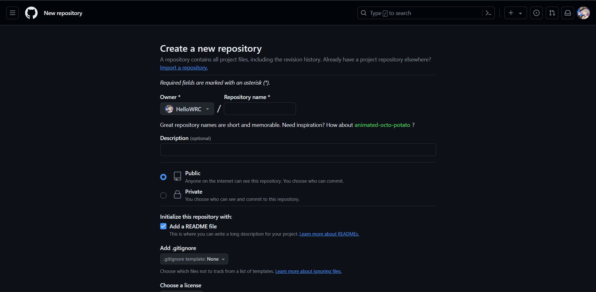
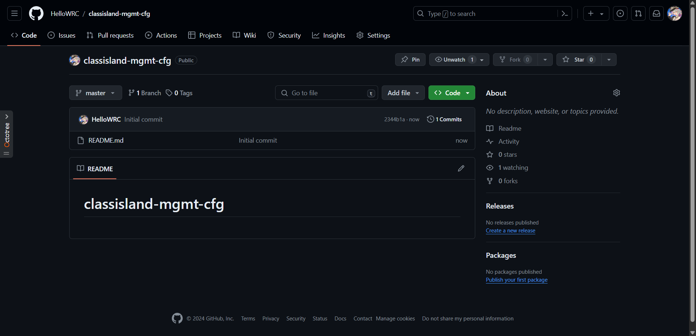
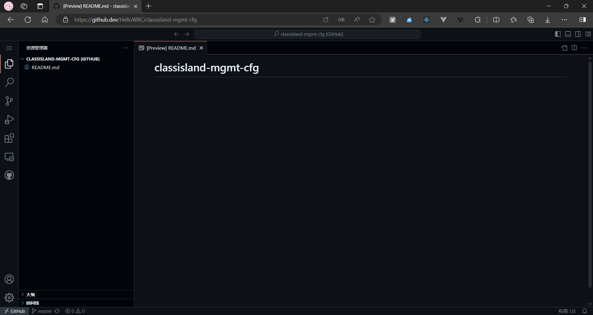
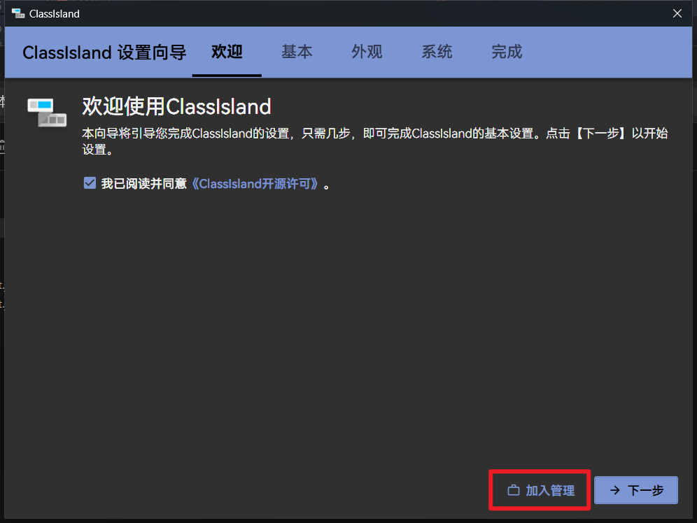
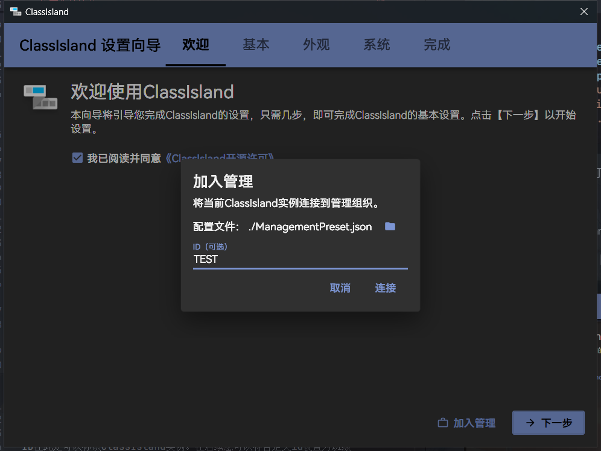
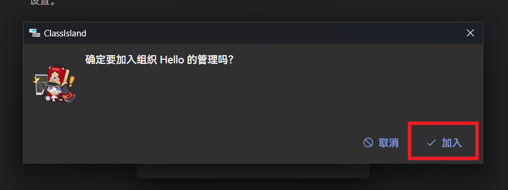
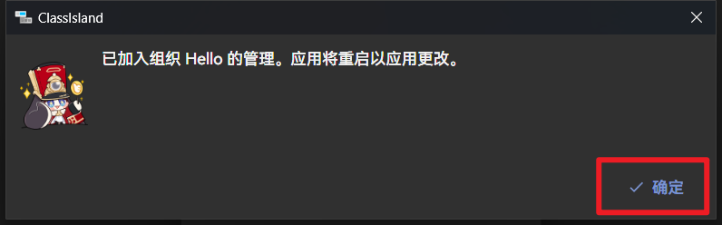
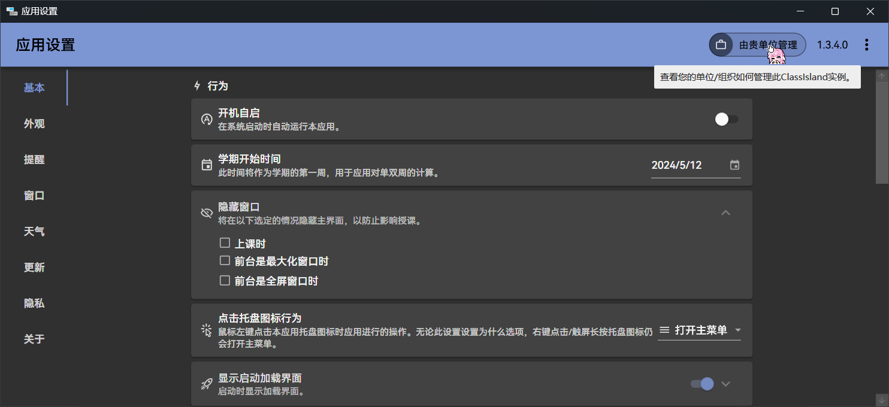
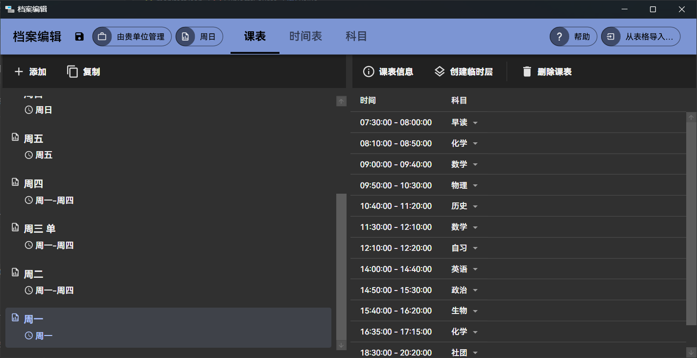
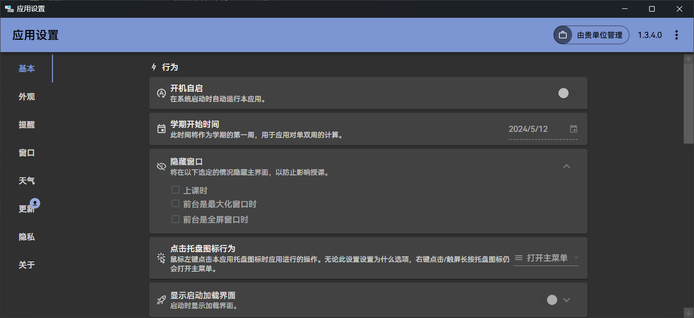

# 教程：手动编写集控配置文件

本教程将指引您手动编写集控配置文件，并将其静态托管到网上。

!!! note "如果您要为一个大型的组织维护集控，手动编辑集控配置会非常麻烦。在这种情况下，建议您使用集控服务器。"

每当你看见👉️符号，就说明你应该做一些事情。而其余的只供您参考和更深入的理解。

!!! tip "在这个教程中，我们将使用GitHub作为示例，并使用[GitHub Codespaces](https://github.dev)在线编辑这些配置文件。如果您要使用其它的平台，请自行替换文中与GitHub有关的操作。"

!!! tip "如果在您的网络环境下无法正常连接GitHub，请考虑使用GitHub的替代品（如[Gitee](https://gitee.com/)）完成本教程。"

## 在开始之前

我们需要在本地安装一个ClassIsland实例来测试集控。

**👉️按照指示[下载并安装ClassIsland本体](**👉️在GitHub上[新建一个公开存储库](https://github.com/new)，并命名为`classisland-mgmt-cfg`。**)。**

!!! tip "如果您之前安装过 ClassIsland，建议您在另一位置安装一个新的实例，并在新的实例中完成本教学的内容。"

为了托管我们的集控配置，我们需要在GitHub上[新建一个存储库](https://github.com/new)。

**👉️在GitHub上[新建一个公开存储库](https://github.com/new)，并命名为`classisland-mgmt-cfg`。**

**👉️在创建仓库界面勾选【Add a README file】复选框**



!!! note "为了方便，我们在这里统一将仓库命名为`classisland-mgmt-cfg`，您也可以给仓库起一个您喜欢的名字。"

为了在创建仓库时一起将仓库初始化，我们在这里勾选【Add a README file】，让 GitHub 在创建仓库时创建README文件，并初始化仓库。

在仓库创建好之后，我们进入了仓库的主界面（如图所示）：



现在我们需要进入 GitHub Codespaces 来编辑仓库里的文件。

**👉️在仓库界面按下键盘上的<kbd>.</kbd>（英文句号）进入GitHub Codespaces。**



现在万事俱备，我们可以开始编写集控的配置文件了。

## 编写集控清单

集控清单文件包含了要拉取的集控相关文件的信息和组织的相关信息，相当于一个索引文件。ClassIsland在加入集控后，会拉取这个文件，并根据此文件中的配置来拉取相关的文件。

**👉️新建一个文件，并命名为`manifest.json`。**

**👉️将以下文本粘贴到`manifest.json中`**

```json title="manifest.json"
{
    "ServerKind": 0,
    "OrganizationName": "Hello"
}
```

这就是一个最基础的清单文件了。这个文件说明了服务器类型是静态托管的，并且说明了组织名称。我们之后会根据需要逐渐完善这个文件。

!!! tip "您可以试着根据[集控配置文档](configure.md#mgmt-manifest)中的说明修改`OrganizationName`字段，设置自定义的组织名。"

**👉️在编辑器【Git】工具窗口中提交更改。**

我们要将当前的更改提交到GitHub上。提交完成后，我们就能在GitHub上看到我们的文件了。

接下来回到本地，我们在ClassIsland安装目录中新建一个集控配置文件，来告诉ClassIsland实例应该从哪里拉取集控清单。

**👉️在ClassIsland安装文件夹中新建一个文件，并命名为`ManagementPreset.json`，并用本地文本编辑器打开。**

**👉将以下文本粘贴到`ManagementPreset.json`中，并将`ManifestUrlTemplate`字段中用户名部分替换成你的GitHub用户名。**

```json title="ManagementPreset.json"
{
    "ManagementServerKind": 0,
    "ManagementServer": "",
    "ManifestUrlTemplate": "https://raw.githubusercontent.com/（把这里替换成你的GitHub用户名）/classisland-mgmt-cfg/master/manifest.json",
}
```

编辑好集控配置后，我们就可以将这个文件导入到ClassIsland实例中了。

**👉运行ClassIsland。**

如果您是第一次运行ClassIsland，此时ClassIsland会弹出欢迎向导。

**👉同意许可协议，然后点击【加入集控】按钮。**



!!! tip "如果您先前已经完成欢迎向导，您可以[根据此处的文档](connect-to-mgmt-server.md)来加入集控。"

此时会弹出集控加入界面，并自动加载了我们刚刚放置在应用目录下的`ManagementPreset.json`文件。您可以点击【浏览】按钮选择其它的配置文件。



**👉在ID一栏填入`TEST`**

ID在此处可以标识ClassIsland实例。在后续的实际应用中，您可以将自定义id设置为班级名、教室编号等易于识别的名称。

**👉点击【连接】按钮。**

此时应用会下载集控清单文件，速度因网络环境而异。在下载完成后，应用会弹出最后的集控加入确认窗口。

**👉在弹出的确认提示框上，点击【加入】按钮。**



**👉在弹出的加入成功提示框上，点击【确定】按钮。**



此时应用会重新启动。在重新启动后，进入【应用设置】，您可以看到右上角出现了【由贵单位管理】徽章。



🎉恭喜！您现在已经成功地加入了集控！

## 拉取档案

尽管我们已经成功加入了集控，但目前它还没有任何作用。接下来我们将引入档案配置。

我们为本教程预制了档案文件，这样我们就可以专注于编写集控配置。

回到 GitHub Codespaces 中，我们接下来的操作将在这上面完成。

**👉将[此处](https://gist.github.com/HelloWRC/a0d817648c8f65f26e7d1ab3eb762917/raw/ff6867942311c0c297e90710ab5cd7d147ae98eb/subjects.json)的文件内容复制到`subjects.json`**

**👉将[此处](https://gist.githubusercontent.com/HelloWRC/a0d817648c8f65f26e7d1ab3eb762917/raw/ff6867942311c0c297e90710ab5cd7d147ae98eb/timelayouts.json)的文件内容复制到`timelayouts.json`**

**👉将[此处](https://gist.github.com/HelloWRC/a0d817648c8f65f26e7d1ab3eb762917/raw/ff6867942311c0c297e90710ab5cd7d147ae98eb/classplans.json)的文件内容复制到`classplans.json`**

这些文件分别存储了科目、时间表和课表信息。尽管这些文件仍然以ClassIsland档案文件格式存储，但在加载时只会加载相应的部分。您也可以上传并使用自己的档案文件。

**👉在`manifest.json`中添加以下高亮代码，并将所有url中中用户名部分替换成你的GitHub用户名。**

```json title="manifest.json" hl_lines="4-15"
{
    "ServerKind": 0,
    "OrganizationName": "Hello",
    "ClassPlanSource": {
        "Value": "https://raw.githubusercontent.com/（把这里替换成你的GitHub用户名）/classisland-mgmt-cfg/master/classplans.json",
        "Version": 1
    },
    "TimeLayoutSource": {
        "Value": "https://raw.githubusercontent.com/（把这里替换成你的GitHub用户名）/classisland-mgmt-cfg/master/timelayouts.json",
        "Version": 1
    },
    "SubjectsSource": {
        "Value": "https://raw.githubusercontent.com/（把这里替换成你的GitHub用户名）/classisland-mgmt-cfg/master/subjects.json",
        "Version": 1
    }
}
```

在我们刚刚添加的内容中，包含了3个url，以及对应url的版本。这些url分别指向我们存储到GitHub仓库上的科目、时间表和课表信息。这些字段被称为[`ReVersionString`](configure.md#reversionstring)，可以存储url和对应url的版本。在ClassIsland拉取清单时，只有在检测到url版本比本地存储的版本更新时，才会更新相关数据。

!!! warning "在修改这些字段的url，或者这些字段的url指向的内容时，请务必记得增加版本数，否则ClassIsland实例可能不会更新这些数据。"

**👉️在编辑器【Git】工具窗口中提交更改。**

**👉️重启ClassIsland实例。**

如果前面的步骤没有差错，ClassIsland会自动拉取档案。您可以在启动应用后，进入【档案编辑】界面，查看拉取的档案。



## 应用url模板

我们刚刚成功地完成了集控档案的分发。然而在实际情况下，我们在将集控部署到多台设备上时，还需要为每台设备分配不同的课表等信息。在这里我们可以在清单文件的url中填入url模板，以让ClassIsland实例在获取信息时将模板替换成对应的信息。

比如我们有这样一个url：

```
https://example.com/client/{id}/policy.json
```

其中的`{id}`是一个url模板，它告诉ClassIsland在请求这个url时，要将这个模板替换成当前的集控id。按照本教程设定的的id`TEST`，在请求时刚刚的url会被处理成这样：

```
https://example.com/client/TEST/policy.json
```

我们可以用利用这一个特性，为每一台设备上的ClassIsland实例指派不同的id，以在ClassIsland获取清单文件时，通过将清单中url中的模板替换成实例的id来实现向不同的设备分配不同的课表配置。

要了解更多关于Url模板的用法，可以看看[这篇文档](client-identify.md#url-template)。

**👉️在仓库中新建两个文件夹，分别命名为`TEST`和`HELLO`**

**👉将[此处](https://gist.github.com/HelloWRC/a0d817648c8f65f26e7d1ab3eb762917/raw/ff6867942311c0c297e90710ab5cd7d147ae98eb/classplans.json)的文件内容复制到`TEST/classplans.json`**

**👉将[此处](https://gist.githubusercontent.com/HelloWRC/a0d817648c8f65f26e7d1ab3eb762917/raw/9226d120d3eeab8861a665236ad005f40df0cf20/classplans-2.json)的文件内容复制到`HELLO/classplans.json`**

**👉在`manifest.json`中替换以下高亮代码，并将所有url中中用户名部分替换成你的GitHub用户名。**

```json title="manifest.json" hl_lines="5-6"
{
    "ServerKind": 0,
    "OrganizationName": "Hello",
    "ClassPlanSource": {
        "Value": "https://raw.githubusercontent.com/（把这里替换成你的GitHub用户名）/classisland-mgmt-cfg/master/{id}/classplans.json",
        "Version": 2
    },
    "TimeLayoutSource": {
        "Value": "https://raw.githubusercontent.com/（把这里替换成你的GitHub用户名）/classisland-mgmt-cfg/master/timelayouts.json",
        "Version": 1
    },
    "SubjectsSource": {
        "Value": "https://raw.githubusercontent.com/（把这里替换成你的GitHub用户名）/classisland-mgmt-cfg/master/subjects.json",
        "Version": 1
    }
}
```

在刚刚的修改中，我们为课表源项目添加了url模板，这样在获取课表时可以按照id获取对应的课表。同时我们增加了版本号`Version`，以告诉ClassIsland这个项目已经更新，需要重新获取。

**👉️在编辑器【Git】工具窗口中提交更改。**

**👉️重启ClassIsland实例。**

现在我们已经成功地添加了模板。您可以试着先[退出集控](connect-to-mgmt-server.md#exit)，然后再以`HELLO`的id加入集控。您可以看到应用已经拉取了不同的课表。

在实际情况下，您可以根据需要，在不同的url上添加模板。

## 策略

除了分发课表，ClassIslad集控还支持制定策略，限制实例的某些功能。您可以根据需要为您的组织设置策略。

**👉️在将下列配置复制到`policy.json`**

```json title="policy.json" 
{
    "DisableSettingsEditing": true
}
```

上面是一个简单的[策略文件](policy.md)，告诉ClassIsland应该禁止编辑设置文件。

**👉在`manifest.json`中替换以下高亮代码，并将所有url中中用户名部分替换成你的GitHub用户名。**

```json title="manifest.json" hl_lines="16-19"
{
    "ServerKind": 0,
    "OrganizationName": "Hello",
    "ClassPlanSource": {
        "Value": "https://raw.githubusercontent.com/（把这里替换成你的GitHub用户名）/classisland-mgmt-cfg/master/{id}/classplans.json",
        "Version": 2
    },
    "TimeLayoutSource": {
        "Value": "https://raw.githubusercontent.com/（把这里替换成你的GitHub用户名）/classisland-mgmt-cfg/master/timelayouts.json",
        "Version": 1
    },
    "SubjectsSource": {
        "Value": "https://raw.githubusercontent.com/（把这里替换成你的GitHub用户名）/classisland-mgmt-cfg/master/subjects.json",
        "Version": 1
    },
    "PolicySource": {
        "Value": "https://raw.githubusercontent.com/（把这里替换成你的GitHub用户名）/classisland-mgmt-cfg/master/policy.json",
        "Version": 1
    }
}
```

我们在清单中添加了对集控策略的引用。

**👉️在编辑器【Git】工具窗口中提交更改。**

**👉️重启ClassIsland实例。**

在重启应用后打开设置界面，您可以看到设置编辑功能已被禁用。



您可以进一步阅读[策略文件](policy.md)文档，了解其它的策略配置，并根据需要自定义策略。

## 结语

🎉恭喜！您现在已经对手动编辑集控有了初步的认识。您可以进一步研究其它的文档，来更深入地了解编写集控配置的方法。